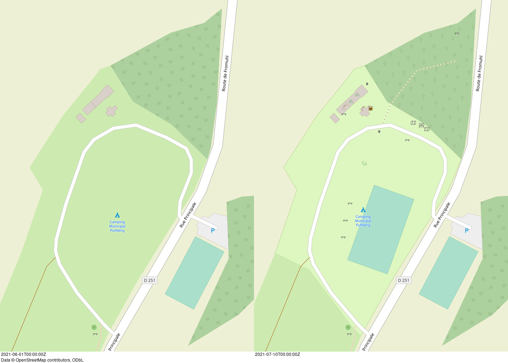

# Mapping party before–after

Make a image of OSM data of an area from 2 dates, showing what was changed.

## Installation

1. *On macOS:* [install Homebrew](https://brew.sh/#:~:text=Install%20Homebrew)
1. [Install `pipx`](https://pipx.pypa.io/stable/installation/#installing-pipx)
1. [Install `openstreetmap-carto`](https://github.com/gravitystorm/openstreetmap-carto/blob/4ec2dc9391c411e124c78b3ba1aad9173fea20cb/INSTALL.md)
1. Install [`osmium-tool`](https://github.com/osmcode/osmium-tool)
1. [Install Mapnik](https://github.com/mapnik/mapnik/blob/master/INSTALL.md#source-build)
1. [Install `python-mapnik`](https://github.com/mapnik/python-mapnik#building-from-source)
1. Install [`nik4`](https://github.com/Zverik/Nik4) (used to generate an image with the [`openstreetmap-carto` map style](https://github.com/gravitystorm/openstreetmap-carto/)):
   ```bash
   pipx install nik4
   ```
1. [Install GraphicsMagick](http://www.graphicsmagick.org/README.html#id4)
1. Clone this repo:
   ```bash
   git clone --recurse-submodules https://github.com/amandasaurus/osm-mapping-party-before-after
   cd osm-mapping-party-before-after
   ```
1. *On macOS:* replace built-in `coreutils` commands with the GNU ones:
   ```bash
   brew install coreutils
   export PATH="$HOMEBREW_PREFIX/opt/coreutils/libexec/gnubin:$PATH
   ```

## Usage

1. Download an OSM history file (`.osh.pbf`) e.g. from [Geofabrik's internal download server](https://osm-internal.download.geofabrik.de/?landing_page=true). You will need to log in with an OSM account.
1. Calculate the `BBOX` with [BBoxFinder.com](http://bboxfinder.com/).
    1. *Draw a rectangle*
    1. Copy the *Box* value
1. Run the following command:
    ```bash
    ./make.sh OSM_HISTORY_FILE.osh.pbf BEFORE_TIME AFTER_TIME BBOX MIN_ZOOM MAX_ZOOM
    ```
    The `BEFORE_TIME` & `AFTER_TIME` are ISO 8601 timestamps.

## Example output



## Copyright & Licence

Copyright © 2021, Affero GPL v3+ (see [LICENCE](./LICENCE)). Project is [`osm-mapping-party-before-after` on GitHub](https://github.com/amandasaurus/osm-mapping-party-before-after)
